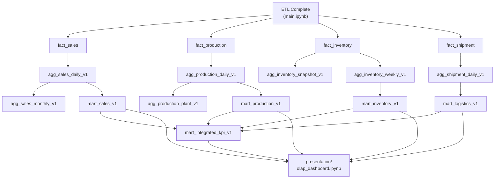

# OLAP Analytical Engine Plan
## Data Warehouse — OLAP to Presentation Layer Design

**Project:** Data Warehouse Final (PT Lautan Luas)
**Database:** PostgreSQL (warehouse) · SQLite (source systems)
**Date:** Mei 2026
**Version:** 2.0 — Comprehensive OLAP & Presentation Design

---

## 1. Executive Summary

Dokumen ini merancang lapisan OLAP (*Online Analytical Processing*) dan Presentation di atas warehouse yang telah selesai dibangun. Warehouse sudah memiliki **8 dimensi** dan **4 tabel fakta** yang sepenuhnya terisi melalui pipeline ETL di `main.ipynb`.

Lapisan OLAP berfungsi sebagai jembatan antara raw warehouse dan kebutuhan analisis bisnis. Lapisan Presentation mewujudkannya dalam bentuk pivot tables, KPI scorecard, dan visualisasi di Jupyter notebook.

**Struktur Implementasi:**
```
Source Systems → ETL (main.ipynb) → Warehouse (dim + fact)
    → OLAP Layer (olap/build_olap.py + DDL)
        → Presentation Layer (presentation/olap_dashboard.ipynb)
```

---

## 2. Arsitektur Stack Lengkap

```
╔══════════════════════════════════════════════════════════════════════╗
║  LAYER 5 — PRESENTATION                                              ║
║  presentation/olap_dashboard.ipynb                                   ║
║  Pandas pivot tables · Matplotlib/Seaborn charts · KPI scorecards   ║
╠══════════════════════════════════════════════════════════════════════╣
║  LAYER 4 — DATA MART (Wide Denormalized)                             ║
║  mart_sales_v1 · mart_production_v1                                  ║
║  mart_inventory_v1 · mart_logistics_v1 · mart_integrated_kpi_v1     ║
╠══════════════════════════════════════════════════════════════════════╣
║  LAYER 3 — AGGREGATION TABLES                                        ║
║  agg_sales_daily_v1 · agg_sales_monthly_v1                           ║
║  agg_production_daily_v1 · agg_production_plant_v1                   ║
║  agg_inventory_snapshot_v1 · agg_inventory_weekly_v1                 ║
║  agg_shipment_daily_v1                                               ║
╠══════════════════════════════════════════════════════════════════════╣
║  LAYER 2 — DATA WAREHOUSE                                            ║
║  Dims: dim_time · dim_region · dim_segment · dim_product             ║
║        dim_customer · dim_employee · dim_warehouse · dim_plant       ║
║  Facts: fact_sales · fact_production · fact_inventory · fact_shipment║
╠══════════════════════════════════════════════════════════════════════╣
║  LAYER 1 — ETL (main.ipynb)                                          ║
║  Extract → Transform → Load → Validate                               ║
╠══════════════════════════════════════════════════════════════════════╣
║  LAYER 0 — SOURCE SYSTEMS                                            ║
║  CRM(JSON) · ERP(SQLite) · WMS(CSV) · HR(CSV) · SO(JSON) · MRP(SQLite)║
╚══════════════════════════════════════════════════════════════════════╝
```

---

## 3. Subject Area dan Grain

### 3.1 Peta Subject Area

| Subject Area | Fact Table | Grain | Dimensi Utama | Volume (Est.) |
|---|---|---|---|---|
| **Sales** | `fact_sales` | Per order line item | Time, Product, Customer, Region, Segment, Employee, Warehouse | ~151 rows |
| **Production** | `fact_production` | Per production order result | Time, Product, Plant, Segment | ~40 rows |
| **Inventory** | `fact_inventory` | Per product-warehouse-period | Time, Product, Warehouse, Segment | ~2,000 rows |
| **Shipment** | `fact_shipment` | Per shipment | Time, Customer, Region, Warehouse | ~45 rows |

### 3.2 Conformed Dimensions

| Dimension | Dipakai oleh Subject Area | Hierarki |
|---|---|---|
| `dim_time` | Sales, Production, Inventory, Shipment | Year → Quarter → Month → Day |
| `dim_region` | Sales, Production (via Plant), Inventory (via WH), Shipment | Country → is_domestic → Region |
| `dim_segment` | Sales, Production, Inventory | Flat (4 values: CON, RET, HRC, MFG) |
| `dim_product` | Sales, Production, Inventory | Principal → Category → Product |

---

## 4. Star Schema Diagrams

### 4.1 Sales Star Schema

```mermaid
erDiagram
    FACT_SALES {
        int sales_fact_id PK
        int time_id FK
        int product_id FK
        int customer_id FK
        int region_id FK
        int segment_id FK
        int employee_id FK
        int warehouse_id FK
        decimal quantity_ordered
        decimal unit_price
        decimal net_amount
        decimal gross_margin_pct
    }
    DIM_TIME { int time_id PK; date full_date; string month_name; int quarter; int year }
    DIM_PRODUCT { int product_id PK; string product_name; string product_category; string principal_name }
    DIM_CUSTOMER { int customer_id PK; string customer_name; string customer_type; string industry_segment }
    DIM_REGION { int region_id PK; string region_name; string country; bool is_domestic }
    DIM_SEGMENT { int segment_id PK; string segment_code; string segment_name }
    DIM_EMPLOYEE { int employee_id PK; string full_name; string department }
    DIM_WAREHOUSE { int warehouse_id PK; string warehouse_name; string warehouse_type }

    FACT_SALES }o--|| DIM_TIME : time_id
    FACT_SALES }o--|| DIM_PRODUCT : product_id
    FACT_SALES }o--|| DIM_CUSTOMER : customer_id
    FACT_SALES }o--|| DIM_REGION : region_id
    FACT_SALES }o--|| DIM_SEGMENT : segment_id
    FACT_SALES }o--|| DIM_EMPLOYEE : employee_id
    FACT_SALES }o--|| DIM_WAREHOUSE : warehouse_id
```

### 4.2 Production Star Schema

```mermaid
erDiagram
    FACT_PRODUCTION {
        int production_fact_id PK
        int time_id FK
        int product_id FK
        int plant_id FK
        int segment_id FK
        decimal planned_qty
        decimal actual_qty
        decimal yield_pct
        decimal total_production_cost
    }
    DIM_TIME { int time_id PK; string month_name; int quarter; int year }
    DIM_PRODUCT { int product_id PK; string product_name; string product_category; string principal_name }
    DIM_PLANT { int plant_id PK; string plant_name; string plant_type; int region_id }
    DIM_SEGMENT { int segment_id PK; string segment_code; string segment_name }

    FACT_PRODUCTION }o--|| DIM_TIME : time_id
    FACT_PRODUCTION }o--|| DIM_PRODUCT : product_id
    FACT_PRODUCTION }o--|| DIM_PLANT : plant_id
    FACT_PRODUCTION }o--|| DIM_SEGMENT : segment_id
```

### 4.3 Inventory Star Schema

```mermaid
erDiagram
    FACT_INVENTORY {
        int inventory_fact_id PK
        int time_id FK
        int product_id FK
        int warehouse_id FK
        int segment_id FK
        decimal opening_qty
        decimal closing_qty
        decimal inventory_value
    }
    DIM_TIME { int time_id PK; string month_name; int quarter; int year }
    DIM_PRODUCT { int product_id PK; string product_name; string product_category }
    DIM_WAREHOUSE { int warehouse_id PK; string warehouse_name; string warehouse_type }
    DIM_SEGMENT { int segment_id PK; string segment_code; string segment_name }

    FACT_INVENTORY }o--|| DIM_TIME : time_id
    FACT_INVENTORY }o--|| DIM_PRODUCT : product_id
    FACT_INVENTORY }o--|| DIM_WAREHOUSE : warehouse_id
    FACT_INVENTORY }o--|| DIM_SEGMENT : segment_id
```

### 4.4 Shipment Star Schema

```mermaid
erDiagram
    FACT_SHIPMENT {
        int shipment_fact_id PK
        int time_id FK
        int customer_id FK
        int region_id FK
        int warehouse_id FK
        string shipping_method
        decimal freight_cost
        bool on_time_flag
    }
    DIM_TIME { int time_id PK; string month_name; int quarter; int year }
    DIM_CUSTOMER { int customer_id PK; string customer_name; string customer_type }
    DIM_REGION { int region_id PK; string region_name; string country; bool is_domestic }
    DIM_WAREHOUSE { int warehouse_id PK; string warehouse_name; string warehouse_type }

    FACT_SHIPMENT }o--|| DIM_TIME : time_id
    FACT_SHIPMENT }o--|| DIM_CUSTOMER : customer_id
    FACT_SHIPMENT }o--|| DIM_REGION : region_id
    FACT_SHIPMENT }o--|| DIM_WAREHOUSE : warehouse_id
```

---

## 5. KPI Definitions

### 5.1 Sales KPIs

| KPI | Formula SQL | Target/Benchmark |
|---|---|---|
| Total Revenue | `SUM(net_amount)` | — |
| Units Sold | `SUM(quantity_ordered)` | — |
| Average Order Value | `SUM(net_amount) / COUNT(sales_fact_id)` | — |
| Gross Margin % | `AVG(gross_margin_pct) * 100` | ≥ 30% |
| Unique Customers | `COUNT(DISTINCT customer_id)` | — |
| Revenue per Salesperson | `SUM(net_amount) GROUP BY employee_id` | — |
| Revenue Growth MoM % | `(Rev_M - Rev_M-1) / Rev_M-1 * 100` | Positive |
| Product Mix % | `SUM(net_amount) / SUM(total) * 100` | — |
| Domestic/Export Split | `SUM FILTER is_domestic vs not` | — |

### 5.2 Production KPIs

| KPI | Formula SQL | Target/Benchmark |
|---|---|---|
| Plan Achievement % | `SUM(actual_qty) / SUM(planned_qty) * 100` | ≥ 95% |
| Avg Yield % | `AVG(yield_pct) * 100` | ≥ 90% |
| Implied Scrap % | `(1 - AVG(yield_pct)) * 100` | ≤ 10% |
| Total Production Cost | `SUM(total_production_cost)` | — |
| Cost per Unit | `SUM(cost) / SUM(actual_qty)` | — |
| Qty Variance | `SUM(actual_qty - planned_qty)` | ≥ 0 |

### 5.3 Inventory KPIs

| KPI | Formula SQL | Target/Benchmark |
|---|---|---|
| Avg Closing Stock | `AVG(closing_qty)` | — |
| Total Inventory Value | `SUM(inventory_value)` | — |
| Net Movement | `SUM(closing_qty - opening_qty)` | — |
| Stock-Out Events | `COUNT(*) WHERE closing_qty <= 0` | 0 |
| Over-Stock Events | `COUNT(*) WHERE closing_qty > avg * 2` | 0 |
| Inventory Turnover | `qty_sold / avg_closing_qty` | ≥ 2x |
| Est. DIO (Days) | `avg_qty / avg_daily_sales` | ≤ 30d |

### 5.4 Shipment KPIs

| KPI | Formula SQL | Target/Benchmark |
|---|---|---|
| On-Time Delivery % | `AVG(on_time_flag::int) * 100` | ≥ 95% |
| Total Freight Cost | `SUM(freight_cost)` | — |
| Avg Freight per Shipment | `AVG(freight_cost)` | — |
| Late Shipments | `COUNT(*) WHERE NOT on_time_flag` | 0 |
| SLA Compliance | `OTD% ≥ 95%` | Met / At Risk / Breached |
| Shipping Method Mix | `COUNT(*) GROUP BY shipping_method` | — |

---

## 6. Aggregation Flow Diagram



---

## 7. OLAP Layer — Tabel Lengkap

### 7.1 Aggregation Tables

#### `agg_sales_daily_v1`
**Grain:** 1 row per (time_id, product_id, customer_id, region_id, segment_id, employee_id, warehouse_id)

```sql
CREATE TABLE agg_sales_daily_v1 AS
SELECT
    f.time_id, f.product_id, f.customer_id, f.region_id,
    f.segment_id, f.employee_id, f.warehouse_id,
    SUM(f.quantity_ordered)                         AS qty_sold,
    SUM(f.net_amount)                               AS revenue,
    SUM(f.quantity_ordered * f.unit_price)          AS gross_amount,
    AVG(f.gross_margin_pct)                         AS avg_margin_pct,
    COUNT(f.sales_fact_id)                          AS line_count,
    SUM(f.net_amount)/NULLIF(COUNT(f.sales_fact_id),0) AS avg_line_value,
    CURRENT_TIMESTAMP                               AS created_at
FROM fact_sales f
GROUP BY f.time_id, f.product_id, f.customer_id,
         f.region_id, f.segment_id, f.employee_id, f.warehouse_id;
```

#### `agg_sales_monthly_v1`
**Grain:** 1 row per (year_month, region_id, segment_id, employee_id)

```sql
CREATE TABLE agg_sales_monthly_v1 AS
SELECT
    TO_CHAR(t.full_date, 'YYYYMM')  AS year_month,
    d.region_id, d.segment_id, d.employee_id,
    SUM(d.revenue)                  AS total_revenue,
    SUM(d.qty_sold)                 AS total_qty,
    AVG(d.avg_margin_pct)           AS avg_margin_pct,
    SUM(d.line_count)               AS total_order_lines,
    COUNT(DISTINCT d.customer_id)   AS unique_customers,
    CURRENT_TIMESTAMP               AS created_at
FROM agg_sales_daily_v1 d
JOIN dim_time t ON d.time_id = t.time_id
GROUP BY TO_CHAR(t.full_date, 'YYYYMM'),
         d.region_id, d.segment_id, d.employee_id;
```

#### `agg_production_daily_v1`
**Grain:** 1 row per (time_id, product_id, plant_id, segment_id)

```sql
CREATE TABLE agg_production_daily_v1 AS
SELECT
    f.time_id, f.product_id, f.plant_id, f.segment_id,
    COUNT(f.production_fact_id)                     AS production_runs,
    SUM(f.planned_qty)                              AS total_planned,
    SUM(f.actual_qty)                               AS total_actual,
    SUM(f.actual_qty) - SUM(f.planned_qty)          AS qty_variance,
    SUM(f.actual_qty)/NULLIF(SUM(f.planned_qty),0)  AS achievement_ratio,
    AVG(f.yield_pct)                                AS avg_yield_pct,
    SUM(f.total_production_cost)                    AS total_cost,
    SUM(f.total_production_cost)/NULLIF(SUM(f.actual_qty),0) AS cost_per_unit,
    CURRENT_TIMESTAMP                               AS created_at
FROM fact_production f
GROUP BY f.time_id, f.product_id, f.plant_id, f.segment_id;
```

#### `agg_production_plant_v1`
**Grain:** 1 row per (year_month, plant_id)

```sql
CREATE TABLE agg_production_plant_v1 AS
SELECT
    TO_CHAR(t.full_date, 'YYYYMM')  AS year_month,
    d.plant_id,
    SUM(d.production_runs)          AS monthly_runs,
    SUM(d.total_planned)            AS monthly_planned,
    SUM(d.total_actual)             AS monthly_actual,
    SUM(d.qty_variance)             AS monthly_qty_variance,
    AVG(d.avg_yield_pct)            AS plant_avg_yield,
    SUM(d.total_cost)               AS monthly_total_cost,
    SUM(d.total_cost)/NULLIF(SUM(d.total_actual),0) AS monthly_cost_per_unit,
    CASE WHEN AVG(d.avg_yield_pct) >= 0.95 THEN 'Excellent'
         WHEN AVG(d.avg_yield_pct) >= 0.88 THEN 'Good'
         WHEN AVG(d.avg_yield_pct) >= 0.80 THEN 'Fair'
         ELSE 'Below Target' END    AS yield_status,
    CURRENT_TIMESTAMP               AS created_at
FROM agg_production_daily_v1 d
JOIN dim_time t ON d.time_id = t.time_id
GROUP BY TO_CHAR(t.full_date, 'YYYYMM'), d.plant_id;
```

#### `agg_inventory_snapshot_v1`
**Grain:** 1 row per (product_id, warehouse_id, segment_id) — all-period summary

```sql
CREATE TABLE agg_inventory_snapshot_v1 AS
SELECT
    fi.product_id, fi.warehouse_id, fi.segment_id,
    MAX(fi.time_id)                                AS latest_time_id,
    AVG(fi.closing_qty)                            AS avg_closing_qty,
    MAX(fi.closing_qty)                            AS peak_closing_qty,
    MIN(fi.closing_qty)                            AS min_closing_qty,
    AVG(fi.inventory_value)                        AS avg_inventory_value,
    SUM(fi.inventory_value)                        AS total_inventory_value,
    COUNT(*) FILTER (WHERE fi.closing_qty <= 0)    AS stockout_periods,
    COUNT(fi.inventory_fact_id)                    AS total_snapshots,
    CURRENT_TIMESTAMP                              AS created_at
FROM fact_inventory fi
GROUP BY fi.product_id, fi.warehouse_id, fi.segment_id;
```

#### `agg_inventory_weekly_v1`
**Grain:** 1 row per (year_week, product_id, warehouse_id, segment_id)

```sql
CREATE TABLE agg_inventory_weekly_v1 AS
SELECT
    TO_CHAR(t.full_date, 'IYYYIW')  AS year_week,
    f.product_id, f.warehouse_id, f.segment_id,
    COUNT(f.inventory_fact_id)      AS snapshots_in_week,
    AVG(f.closing_qty)              AS avg_qty,
    MAX(f.closing_qty)              AS max_qty,
    MIN(f.closing_qty)              AS min_qty,
    AVG(f.inventory_value)          AS avg_value,
    COUNT(*) FILTER (WHERE f.closing_qty <= 0) AS stockout_days,
    SUM(GREATEST(f.closing_qty - f.opening_qty, 0)) AS total_net_inflow,
    SUM(GREATEST(f.opening_qty - f.closing_qty, 0)) AS total_net_outflow,
    CURRENT_TIMESTAMP               AS created_at
FROM fact_inventory f
JOIN dim_time t ON f.time_id = t.time_id
GROUP BY TO_CHAR(t.full_date, 'IYYYIW'),
         f.product_id, f.warehouse_id, f.segment_id;
```

#### `agg_shipment_daily_v1`
**Grain:** 1 row per (time_id, region_id, warehouse_id, shipping_method)

```sql
CREATE TABLE agg_shipment_daily_v1 AS
SELECT
    f.time_id, f.region_id, f.warehouse_id, f.shipping_method,
    COUNT(f.shipment_fact_id)       AS total_shipments,
    COUNT(*) FILTER (WHERE f.on_time_flag)      AS on_time_count,
    COUNT(*) FILTER (WHERE NOT f.on_time_flag)  AS late_count,
    ROUND(AVG(CASE WHEN f.on_time_flag THEN 1.0 ELSE 0.0 END)*100,2) AS on_time_pct,
    SUM(f.freight_cost)             AS total_freight_cost,
    AVG(f.freight_cost)             AS avg_freight_cost,
    CURRENT_TIMESTAMP               AS created_at
FROM fact_shipment f
GROUP BY f.time_id, f.region_id, f.warehouse_id, f.shipping_method;
```

---

### 7.2 Data Mart Tables (Wide / Denormalized)

#### `mart_sales_v1`
Denormalized mart dengan semua label dimensi — tidak perlu JOIN dari BI layer.

**Key columns:** `year_month, product_category, principal_name, customer_type, region_name, country, is_domestic, segment_name, salesperson_name, warehouse_type, quantity_ordered, net_amount, gross_margin_pct`

#### `mart_production_v1`
**Key columns:** `year_month, plant_name, plant_type, plant_region, product_category, segment_name, planned_qty, actual_qty, qty_variance, achievement_ratio, yield_pct, implied_scrap_pct, total_production_cost, cost_per_unit`

#### `mart_inventory_v1`
**Key columns:** `year_month, product_category, warehouse_name, warehouse_type, warehouse_region, is_domestic_warehouse, segment_name, opening_qty, closing_qty, net_movement, inventory_value, is_stockout, is_overstock`

#### `mart_logistics_v1`
**Key columns:** `year_month, customer_name, customer_type, region_name, country, is_domestic, warehouse_name, shipping_method, freight_cost, on_time_flag, delivery_status, sla_category`

#### `mart_integrated_kpi_v1`
Cross-subject KPI scorecard — 1 row per year_month.

**Key columns:** `year_month, total_revenue, total_units_sold, avg_sales_margin_pct, unique_customers, total_produced, avg_yield_pct, total_prod_cost, avg_stock_level, stockout_events, total_shipments, otd_pct, total_freight_cost, revenue_per_freight, sell_thru_ratio`

---

### 7.3 Summary Tabel Referensi

| Tabel | Tipe | Grain | Measures Utama | Tujuan |
|---|---|---|---|---|
| `agg_sales_daily_v1` | Agregasi | Harian × 7 dim | revenue, qty_sold, avg_margin | Dashboard sales |
| `agg_sales_monthly_v1` | Agregasi | Bulanan × region-segment-emp | total_revenue, unique_customers | Executive trend |
| `mart_sales_v1` | Wide Mart | Per fact row | Semua measures + labels | BI tools self-service |
| `agg_production_daily_v1` | Agregasi | Harian × plant-product | yield, cost, variance | Production monitoring |
| `agg_production_plant_v1` | Agregasi | Bulanan × plant | plant_avg_yield, cost_per_unit | Plant scorecard |
| `mart_production_v1` | Wide Mart | Per fact row | Semua measures + labels | BI tools |
| `agg_inventory_snapshot_v1` | Snapshot | All-time × product-WH | avg_qty, stockout_periods | Current stock |
| `agg_inventory_weekly_v1` | Agregasi | Mingguan × product-WH | avg_qty, health_score | Inventory health |
| `mart_inventory_v1` | Wide Mart | Per fact row | net_movement, flags | BI tools |
| `agg_shipment_daily_v1` | Agregasi | Harian × region-WH-method | on_time_pct, freight | Logistics KPI |
| `mart_logistics_v1` | Wide Mart | Per fact row | freight_cost, sla_category | Delivery analysis |
| `mart_integrated_kpi_v1` | Cross-Subject | Bulanan | Semua KPI gabungan | Executive scorecard |

---

## 8. OLAP Operations — Query Catalog

### SLICE — Filter satu dimensi
```sql
SELECT year_month, SUM(revenue) FROM agg_sales_daily_v1
WHERE region_id = 1 GROUP BY year_month;
```

### DICE — Filter multi-dimensi
```sql
SELECT year_month, SUM(revenue) FROM agg_sales_daily_v1 d
JOIN dim_product p ON d.product_id = p.product_id
WHERE d.segment_id = 3 AND d.region_id = 1 AND p.product_category = 'Pharma'
GROUP BY year_month;
```

### DRILL-DOWN — Month → Day
```sql
SELECT time_id, SUM(revenue) FROM agg_sales_daily_v1
WHERE time_id BETWEEN 20250301 AND 20250331
GROUP BY time_id ORDER BY time_id;
```

### ROLL-UP — Day → Quarter
```sql
SELECT t.year, t.quarter, r.region_name, SUM(d.revenue)
FROM agg_sales_daily_v1 d
JOIN dim_time t ON d.time_id = t.time_id
JOIN dim_region r ON d.region_id = r.region_id
GROUP BY t.year, t.quarter, r.region_name ORDER BY 1,2;
```

### PIVOT — Revenue per Region vs Product Category
```sql
SELECT p.product_category,
    SUM(CASE WHEN d.region_id = 1 THEN d.revenue ELSE 0 END) AS rev_JKT,
    SUM(CASE WHEN d.region_id = 2 THEN d.revenue ELSE 0 END) AS rev_SBY,
    SUM(CASE WHEN d.region_id = 3 THEN d.revenue ELSE 0 END) AS rev_BDG,
    SUM(CASE WHEN d.region_id = 4 THEN d.revenue ELSE 0 END) AS rev_SGP,
    SUM(d.revenue) AS total
FROM agg_sales_daily_v1 d
JOIN dim_product p ON d.product_id = p.product_id
GROUP BY p.product_category ORDER BY total DESC;
```

---

## 9. Presentation Layer

### 9.1 Struktur Notebook

File: `presentation/olap_dashboard.ipynb`

| Bagian | Konten |
|---|---|
| **0. Setup** | DB connection, helper functions, palette |
| **1. Sales Analytics** | Revenue pivot per region/produk, MoM growth, top customers, salesperson ranking |
| **2. Production Analytics** | Yield per plant, cost per unit trend, plan vs actual variance |
| **3. Inventory Analytics** | Stock level heatmap per product-WH, turnover, stockout summary |
| **4. Shipment Analytics** | OTD % per region, freight by method, SLA compliance gauge |
| **5. Integrated KPI Scorecard** | Cross-subject monthly table + composite bar chart |

### 9.2 Visualisasi per Bagian

```
Section 1 — Sales:
  ├── Bar chart: Revenue per Region (stacked by Segment)
  ├── Line chart: Monthly Revenue Trend + MoM Growth %
  ├── Heatmap: Revenue pivot (Product Category × Region)
  └── Horizontal bar: Top 10 Customers by Revenue

Section 2 — Production:
  ├── Bar chart: Avg Yield % per Plant (color-coded by status)
  ├── Grouped bar: Planned vs Actual Qty per Quarter
  ├── Line chart: Cost per Unit Trend
  └── Table: Plant Performance Scorecard

Section 3 — Inventory:
  ├── Heatmap: Avg Closing Stock (Product × Warehouse)
  ├── Bar chart: Net Movement per Product Category
  ├── KPI tiles: Stockout events, Overstock events
  └── Pie chart: Inventory Value Distribution by Warehouse

Section 4 — Shipment:
  ├── Bar chart: OTD % per Region (threshold line at 95%)
  ├── Stacked bar: Shipment Method Distribution
  ├── Box plot: Freight Cost per Shipping Method
  └── Table: SLA Compliance Status per Region

Section 5 — Integrated KPI:
  ├── KPI scorecard table (monthly × all metrics)
  ├── Multi-axis line chart: Revenue vs OTD% vs Yield%
  └── Bar chart: Sell-Through Ratio (Sales vs Production)
```

---

## 10. File Inventory — Implementasi

| File | Tujuan |
|---|---|
| `analytic_engine_plan.md` | Dokumen desain OLAP (dokumen ini) |
| `olap/__init__.py` | Package init |
| `olap/ddl.py` | DDL constants semua agg + mart tables |
| `olap/build_olap.py` | Orchestrator: drop, create, build, validate |
| `alembic/migration/versions/xxxx_olap_layer.py` | Alembic migration untuk OLAP schema |
| `presentation/olap_dashboard.ipynb` | Jupyter notebook analitik lengkap |

---

## 11. Refresh Strategy

### Urutan Refresh

```
1. ETL selesai (main.ipynb) → fact tables terupdate
2. DROP + CREATE agg_sales_daily_v1
3. DROP + CREATE agg_production_daily_v1
4. DROP + CREATE agg_inventory_snapshot_v1, agg_inventory_weekly_v1
5. DROP + CREATE agg_shipment_daily_v1
6. DROP + CREATE agg_sales_monthly_v1, agg_production_plant_v1
7. DROP + CREATE semua mart_*_v1
8. Jalankan validasi DQ checks
9. (Opsional) Re-run notebook cells
```

### Schedule

| Tabel | Frekuensi |
|---|---|
| `agg_*_daily_v1` | Harian post-ETL |
| `agg_*_monthly_v1` | Bulanan (1 hari setelah bulan tutup) |
| `agg_inventory_weekly_v1` | Mingguan (Senin pagi) |
| `mart_*_v1` | Harian (setelah semua agg selesai) |

---

## 12. Data Quality Checks

```sql
-- DQ-1: Revenue consistency (fact vs mart)
SELECT 'DQ-1: Revenue Match' AS check_name,
    ABS((SELECT SUM(net_amount) FROM fact_sales) -
        (SELECT SUM(revenue) FROM agg_sales_daily_v1)) < 0.01 AS passed;

-- DQ-2: Production cost consistency
SELECT 'DQ-2: Production Cost Match' AS check_name,
    ABS((SELECT SUM(total_production_cost) FROM fact_production) -
        (SELECT SUM(total_cost) FROM agg_production_daily_v1)) < 0.01 AS passed;

-- DQ-3: No null KPIs
SELECT 'DQ-3: No Null Revenue' AS check_name,
    COUNT(*) FILTER (WHERE revenue IS NULL) = 0 AS passed
FROM agg_sales_daily_v1;

-- DQ-4: Inventory row count
SELECT 'DQ-4: Inventory Snapshot Coverage' AS check_name,
    (SELECT COUNT(*) FROM agg_inventory_snapshot_v1) > 0 AS passed;

-- DQ-5: OTD plausibility
SELECT 'DQ-5: OTD Plausibility' AS check_name,
    AVG(on_time_pct) BETWEEN 0 AND 100 AS passed
FROM agg_shipment_daily_v1;
```

---

## 13. Performance Targets

| Metrik | Target |
|---|---|
| Query response time (mart) | < 1 detik |
| Query response time (agg) | < 2 detik |
| Data freshness | < 24 jam |
| Aggregation accuracy (variance) | 0.00 |
| OTD rate | ≥ 95% |
| Production yield | ≥ 90% |
| Stockout events per periode | 0 |

---

## 14. Version History

| Versi | Tanggal | Perubahan |
|---|---|---|
| 1.0 | Mei 2026 | Initial design: subject areas, KPI, summary table strategy |
| 2.0 | Mei 2026 | Full redesign: Mermaid diagrams, complete DDL, data mart specs, presentation layer plan, DQ checks, refresh strategy |

---

*End of Document — OLAP Analytical Engine Plan v2.0*
